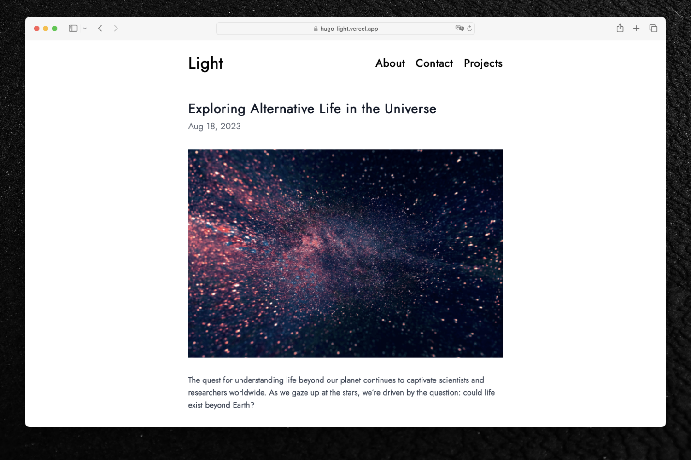
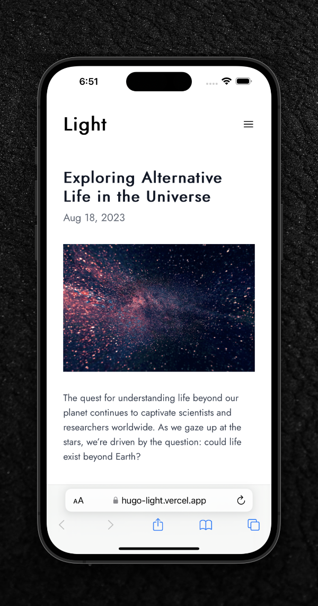

# Light | [Demo](https://hugo-light.vercel.app)

Simple, light and fast theme for [hugo](https://gohugo.io/).

## Overview




## Install

### As git submodule

Inside of your root project directory, run:

```bash
git submodule add https://github.com/alex-birchman/hugo-light.git themes/light
```

Open `config.toml` or `hugo.toml`, change `theme` to `"light"`:

```toml
theme = "light"
```

### As hugo module

Inside of your root project directory, run:

```bash
hugo mod init github.com/alex-birchman/hugo-light
```

Open `config.toml` or `hugo.toml`, remove the `theme` line (if present) and add module section at the bottom of the file:

```toml
[module]
  [[module.imports]]
    path = "github.com/alex-birchman/hugo-light"
```

## License

Distributed under the MIT License. See `LICENSE` for more information.
